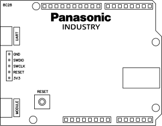
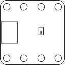
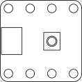
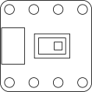
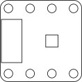

# IoT Components
This is a platform for rapid prototyping of IoT enabled and related applications using selected Panasonic Industry components. The platform consists of hardware building blocks (shields, sensor modules) and software examples.

The PCB layouts and bills of material are freely accessible.

## Arduino Compatibility
For maximum simplicity and compatibility the Arduino UNO form factor has been chosen. The hardware building blocks can be combined with Arduino and third-party boards and shields.

### Pinouts
All shields use 100 mil (2,54 mm) pitch pin headers for connecting to other shields. The passive interface shield uses JST EH 2,5 mm pitch connectors for connecting to sensor and switch breakout boards. All sensor and switch breakout boards use JST PH 2,0 mm pitch connectors.

### Voltages
All sensor breakout boards use 3,3 V unless specified otherwise. All battery shields provide 5 V to Arduino UNO 5 V pin unless specified otherwise.

## Boards
### Bluetooth 5 SoC Module Board

Incorporates Panasonic PAN1780 SoC module featuring Nordic nRF52840 ARM Cortex M4F, 1 MB flash memory, 256 kB RAM and 2.4 GHz tranceiver for Bluetooth 5 and ZigBee applications. The PAN1780 can be programmed through the module USB (bootloader) or SWD interface (using a debug probe). Use this board as the foundation for your project. [DETAILS](boards/8c28)

## Shields
### AA Battery Shield (d19d)

Uses two AA rechargeable batteries to provide 5 V to Arduino UNO 5 V pin for autonomous applications. Maximum output current rating 200 mA. [DETAILS](shields/d19d)

### AAA Battery Shield (d19d)

Uses two AAA rechargeable batteries to provide 5 V to Arduino UNO 5 V pin for autonomous applications. Maximum output current rating 100 mA. [DETAILS](shields/d19d)

### CR123 Battery Shield (a50b)

Uses CR123A or CR2/3 primary cell to provide 3 V to Arduino UNO 3,3 V pin for low-power autonomous applications. Maximum output current rating depends on cells used. [DETAILS](shields/a50b)

### CR2 Battery Shield (a50b)

Uses CR2 cylindric primary cell to provide 3 V to Arduino UNO 3,3 V pin for low-power autonomous applications. Maximum output current rating depends on cells used. [DETAILS](shields/a50b)

### CR2032 Battery Shield (a50b)

Uses CR2032 coin primary cell to provide 3 V to Arduino UNO 3,3 V pin for low-power autonomous applications. Maximum output current rating depends on cells used. [DETAILS](shields/a50b)

### Indoor Solar Energy Harvesting Power Management Shield (ac2f)

Connects to an amorphous solar cell, converts voltage levels, stores harvested energy and powers low-power applications. Provides 1,8 V to Arduino UNO 3,3 V pin. Make sure to use boards and shields capable of ULV operation. [DETAILS](shields/ac2f)

### Indoor Solar Cell Shield (f70c)

Carries a Panasonic Industry Amorton AM-1522CA amorphous solar cell. Plugs into indoor solar energy harvesting power management shield. [DETAILS](shields/f70c)

### Passive Interface Shield (99b8)

Links sensor and switch breakout boards to Arduino UNO, SoC module board and power supply shields. [DETAILS](shields/99b8)

### GPIO Debug Shield (d1ea)

Helps to debug Arduino input and output pins using optical feedback. [DETAILS](shields/d1ea)

### Shield Stacking
All boards and shields are designed to support sensible stacking. It's recommended to start with SoC boards, add interfaces in the middle and put shields with batteries or solar cells at the top.

| Bottom      | Top 8c28 | Top Arduino UNO | Top d19d | Top a50b | Top 99b8 | Top ac2f | Top f70c | Function     |
|-------------|----------|-----------------|----------|----------|-----|-------|-------|-------------------------|
| 8c28        |  -       | -               | YES      | YES      | YES | YES   | (NO)  | BLE SoC Module Board    |
| Arduino UNO |  -       | -               | YES      | (YES)    | YES | (YES) | (NO)  | Arduino UNO Rev. 3      |
| d19d        |  -       | -               | -        | -        | -   | -     | -     | AA/AAA Shield           |
| a50b        |  -       | -               | -        | -        | -   | -     | -     | CR123/CR2/CR2032 Shield |
| 99b8        |  -       | -               | YES      | YES      | YES | YES   | (NO)  | Interface Shield        |
| ac2f        |  -       | -               | NO       | NO       | NO  | NO    | YES   | Power Management Shield |
| f70c        |  -       | -               | -        | -        | -   | -     | -     | Solar Cell Shield       |

* YES: Mechanical fit and electric connection
* (YES): Mechanical fit, electric connection, can lead to unstable behaviour
* NO: Mechanical fit, electric connection, can lead to circuit damage
* (NO): Mechanical fit, no connection
* -: No fit

## Sensor and Switch Breakout Boards

All breakout boards are 30 * 30 mm^2 in size and carry four 3,2 mm (126 mil) bores on each side. The bores' centers are spaced 8 mm apart and allow for easy mechanical connection to prototyping systems with 4, 8, 12, 16 pitch.

### Detector Switch Breakout Board (12f0)

* Panasonic ESE16 series micro switch
* Binary digital output
* 3P connector

Pull-up and pull-down configurations are available. [DETAILS](breakout_boards/12f0)

### Tactile Switch Breakout Board (2665)

* Panasonic EVQQ2 series tactile switch
* Binary digital output
* 3P connector

Pull-up and pull-down configurations are available. [DETAILS](breakout_boards/2665)

### Tactile Switch Breakout Board (c343)

* Panasonic EVQPL series tactile switch
* Binary digital output
* 3P connector

Pull-up and pull-down configurations are available. [DETAILS](breakout_boards/c343)

### Infrared Array Sensor Breakout Board (de26)

* Panasonic AMG8833 or AMG8834 Grid-EYE sensor
* I2C interface (address 0x68 or 0x69)
* 4P connector

[DETAILS](breakout_boards/de26)

### Passive IR Sensor Breakout Board (c141)

* Panasonic EKMC16 series PIR sensor
* Analog and binary digital output (pull-down) versions are available.
* 3P connector

[DETAILS](breakout_boards/c141)

### Passive IR Sensor Breakout Board with LED (7ad7)

* Panasonic EKMC16 series PIR sensor
* Binary digital output (pull-down)
* 3P connector

[DETAILS](breakout_boards/7ad7)

### Pressure Sensor Breakout Board (61db)

* Panasonic PS-A ADP5201 sensor
* Analog output
* 3P connector

[DETAILS](breakout_boards/61db)

### Inertial Sensor Breakout Board (28c2)

* Panasonic EWTS5G inertial sensor
* SPI interface
* 6P connector

[DETAILS](breakout_boards/28c2)

### Particulate Matter Sensor (57ca)
* Panasonic SN-GCJA5 particulate matter (PM) sensor
* I2C interface
* 5P connector (only 4 pins used for I2C operation)

[DETAILS](breakout_boards/57ca)

## Pinouts and Cable Assemblies
Sensors with analog and binary digital output use 3 pin connectors and cable assemblies.
| Pin | Symbol | Function       |
|-----|--------|----------------|
| 1   | VCC    | Supply voltage |
| 2   | OUT    | Output         |
| 3   | GND    | Ground         |

Sensors with I2C interface use 4 pin connectors and cable assemblies.
| Pin | Symbol | Function       |
|-----|--------|----------------|
| 1   | VCC    | Supply voltage |
| 2   | GND    | Ground         |
| 3   | SCL    | Clock          |
| 4   | SDA    | Data           |

Sensors with SPI interface use 6 pin connectors and cable assemblies.
| Pin | Symbol | Function                   |
|-----|--------|----------------------------|
| 1   | VCC    | Supply voltage             |
| 2   | GND    | Ground                     |
| 3   | SCK    | Serial clock               |
| 4   | MISO   | Master input, slave output |
| 5   | MOSI   | Master output, slave input |
| 6   | CS     | Chip select                |

