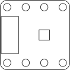

# Inertial Sensor Breakout Board (28c2)

* Panasonic EWTS5G 6 degrees of freedom (DoF) inertial sensor [PRODUCT INFORMATION](https://industry.panasonic.eu/products/components/sensors/6dof-inertial-sensor?utm_campaign=iot-components&utm_medium=github&utm_source=page-28c2)
* SPI interface
* Supply voltage level: 3,3 V

| Pin | Symbol | Function                   |
|-----|--------|----------------------------|
| 1   | VCC    | Supply voltage             |
| 2   | GND    | Ground                     |
| 3   | SCK    | Serial clock               |
| 4   | MISO   | Master input, slave output |
| 5   | MOSI   | Master output, slave input |
| 6   | CS     | Chip select                |
