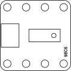

# Long Stroke Sealed Switch Breakout Board (98c6)

* Panasonic AQS series long stroke sealed switch [PRODUCT INFORMATION](https://industry.panasonic.eu/productfinder?mode=FILTER_MODE&group=Switches&category=Switches&lineup=Sealed+micro+switches&series=Turquoise+Stroke+Switches&utm_campaign=iot-components&utm_medium=github&utm_source=page-12f0)
* Pull-down and pull-up operation possible
* Pull-down operation: resistors marked "DN" populated
* Pull-up operation: resistors marked "UP" populated
* Binary digital output
* Supply voltage levels: 1,8...5 V

| Pin | Symbol | Function       |
|-----|--------|----------------|
| 1   | VCC    | Supply voltage |
| 2   | OUT    | Output         |
| 3   | GND    | Ground         |
