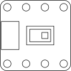

# Infrared Array Sensor Breakout Board (de26)

* Panasonic AMG8833 / AMG8834 infrared array sensor [PRODUCT INFORMATION](https://industry.panasonic.eu/products/components/sensors/ir-thermophile-array-sensor-grid-eye?utm_campaign=iot-components&utm_medium=github&utm_source=page-de26)
* Field of view: 60 °
* Number of pixels: 64 (8*8)
* AMG8833: object temperature 0 to 80 °C, marked "33"
* AMG8834: object temperature -20 to 100 °C, marked "34"
* I2C interface
* Address 0x68: R104 (0 Ohms) populated
* Address 0x69: R103 (10 k) populated
* Supply voltage level: 3,3 V

| Pin | Symbol | Function       |
|-----|--------|----------------|
| 1   | VCC    | Supply voltage |
| 2   | GND    | Ground         |
| 3   | SCL    | Sensor signal  |
| 4   | SDA    | Sensor signal  |
