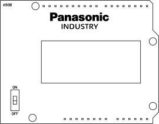
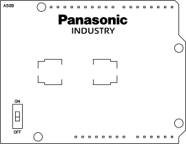
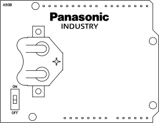

# CR123 / CR2 / CR2032 Battery Shields (a50b)

* Provide 3 V to Arduino UNO 3,3 V pin for powering low-voltage boards.
* A switch is used to disconnect the battery for programming or when not in use.
* Panasonic Lithium batteries [PRODUCT INFORMATION](https://industry.panasonic.eu/products/energy-building/batteries/battery-cells/primary-batteries/lithium-batteries?utm_campaign=iot-components&utm_medium=github&utm_source=page-a50b)

**ATTENTION**

**The PAN1780 board can work of 3 V supplied to 3,3 V pin. Any external power such as USB connections should be disconnected when battery is connected.**

**The original Arduino UNO requires 5 V supplied to 5 V pin for safe operation.**
