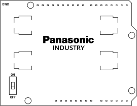

# AA / AAA Battery Shield (d19d)

* Both AA and AAA versions are available.
* Uses two rechargeable NiMH batteries such as [Panasonic BK-200AAB or BK-80AAAB](https://industry.panasonic.eu/products/energy-building/batteries/battery-cells/secondary-batteries-rechargeable-batteries/nickel-metal-hydride-batteries/ni-mh-button-top-type-b-batteries?utm_campaign=iot-components&utm_medium=github&utm_source=page-d19d) to provide 5 V to Arduino UNO 5 V pin for autonomous applications.
* Maximum output current rating 200 mA (AA) or 100 mA (AAA).
