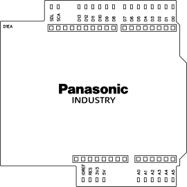

# GPIO Debug Shield (d1ea)

* Helps to debug general-purpose input and output (GPIO) pins non Arduino and compatible boards and shields.
* Individual LEDs provide optical feedback once voltage is applied to a pin.
