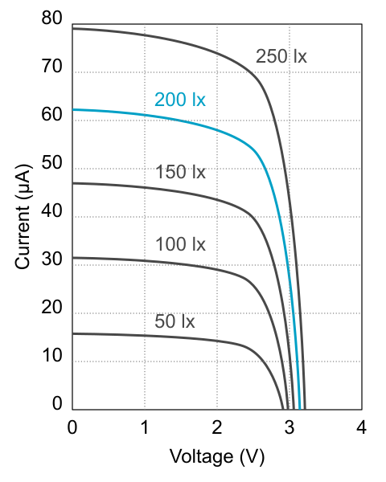

# Indoor Solar Cell Shield (f70c)

* Features a [Panasonic AM-1522CA](https://industry.panasonic.eu/products/energy-building/amorphous-solar-cells/amorton-indoor-environment?utm_campaign=iot-components&utm_medium=github&utm_source=page-f70c) amorphous solar cell for indoor energy harvesting.
* Open-circuit voltage at 200 lx: 3,1 V
* Short-circuit current at 200 lx: 62,2 µA

